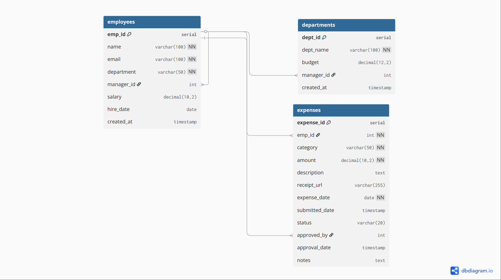

# 📅 DAY 1: Schema Design & Database Setup (PostgreSQL)
## Date : 05 April 2026

## 🎯 Goal

On Day 1, I set up my PostgreSQL database, created all required tables, and inserted sample data for my Employee Expense Management System.

---

## 🛠️ Step 1: Open PostgreSQL

I started by opening PostgreSQL using the terminal:

```bash
psql -U postgres
````

---

## 🗄️ Step 2: Create Database

I created a database for the project:

```sql
CREATE DATABASE expense_system;
```

---

## 🔗 Step 3: Connect to Database

I connected to the newly created database:

```sql
\c expense_system;
```

---

## 🧱 Step 4: Create Tables

### Employees Table

Stores employee info and manager relationships:

```sql
CREATE TABLE employees (
    emp_id SERIAL PRIMARY KEY,
    name VARCHAR(100) NOT NULL,
    email VARCHAR(100) UNIQUE NOT NULL,
    department VARCHAR(50) NOT NULL,
    manager_id INTEGER REFERENCES employees(emp_id),
    salary DECIMAL(10, 2),
    hire_date DATE,
    created_at TIMESTAMP DEFAULT CURRENT_TIMESTAMP
);
```

---

### Expenses Table

Tracks employee expenses and approvals:

```sql
CREATE TABLE expenses (
    expense_id SERIAL PRIMARY KEY,
    emp_id INTEGER NOT NULL REFERENCES employees(emp_id),
    category VARCHAR(50) NOT NULL,
    amount DECIMAL(10, 2) NOT NULL,
    description TEXT,
    receipt_url VARCHAR(255),
    expense_date DATE NOT NULL,
    submitted_date TIMESTAMP DEFAULT CURRENT_TIMESTAMP,
    status VARCHAR(20) DEFAULT 'pending'
        CHECK (status IN ('pending', 'approved', 'rejected')),
    approved_by INTEGER REFERENCES employees(emp_id),
    approval_date TIMESTAMP,
    notes TEXT
);
```

---

### Departments Table

For organizing departments and budgets:

```sql
CREATE TABLE departments (
    dept_id SERIAL PRIMARY KEY,
    dept_name VARCHAR(100) UNIQUE NOT NULL,
    budget DECIMAL(12, 2),
    manager_id INTEGER REFERENCES employees(emp_id),
    created_at TIMESTAMP DEFAULT CURRENT_TIMESTAMP
);
```

---
### 💻 Database Schema Diagram



## ⚡ Step 5: Create Indexes

Added indexes to speed up queries:

```sql
CREATE INDEX idx_emp_id ON expenses(emp_id);
CREATE INDEX idx_status ON expenses(status);
CREATE INDEX idx_category ON expenses(category);
CREATE INDEX idx_expense_date ON expenses(expense_date);
CREATE INDEX idx_submitted_date ON expenses(submitted_date);
```

---

##  Step 6: Insert Sample Data

### Employees Data

Inserted sample employees.

---

### Expenses Data

Inserted sample expenses.

---

## 🔍 Step 7: Verify Data

Checked the tables and data:

```sql
SELECT * FROM employees;
SELECT * FROM expenses;
```

---

## 📊 Step 8: Validate Counts

```sql
SELECT COUNT(*) FROM employees;
SELECT COUNT(*) FROM expenses;
```

---

## ❌ Challenges Faced

* Forgot to connect to the database using `\c`
* Used MySQL syntax (`AUTO_INCREMENT`) before switching to PostgreSQL
* Foreign keys require parent records first

---

## 🎉 Outcome

By the end of Day 1:

* Database schema ready ✅
* Tables created with relationships ✅
* Sample data added and verified ✅

---


